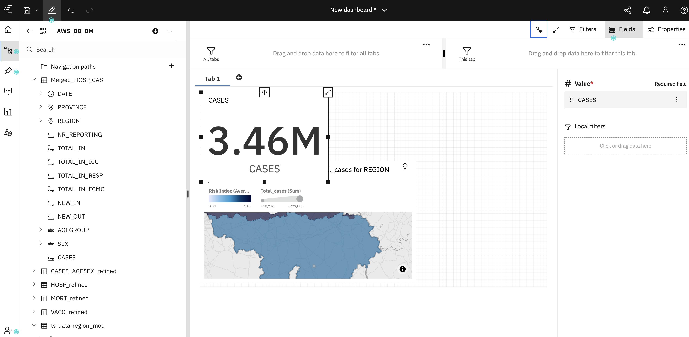
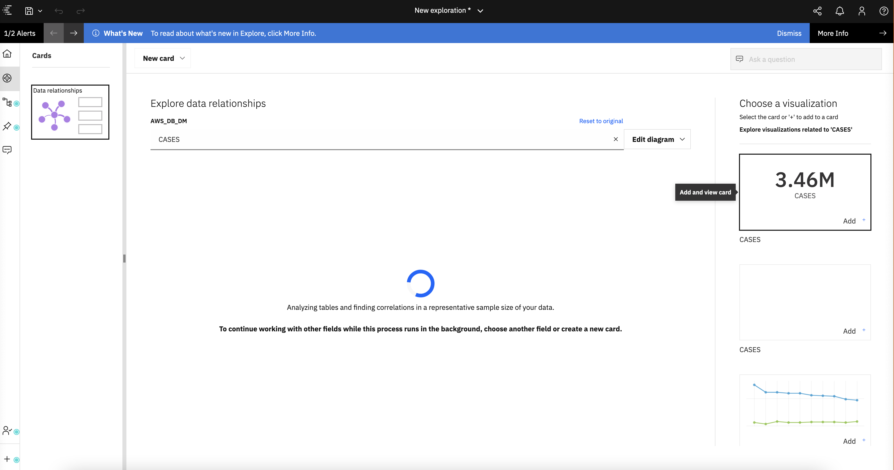
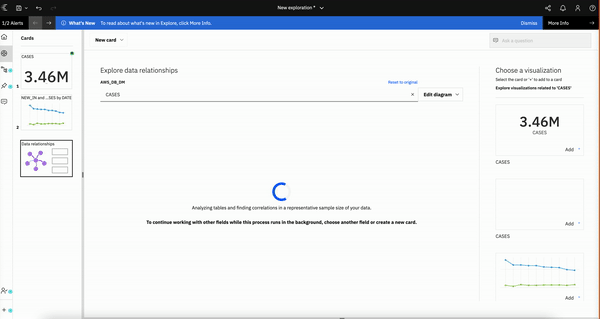

# Generate visualizations using Cognos Analytics of IBM Cloud Pak for Data on AWS opneshift Cluster

IBM Cognos Analytics on IBM Cloud Pak for Data integrates reporting, modeling, analysis, and exploration so you can understand your organization's data - and make effective business decisions. It's a proven, self-service, dependable analytics solution that provides scalability and analytics governance. IBM Cognos Analytics can help you create visualizations and dashboards without needing a data science background.

In this workshop, we will demonstrate the following 3 usecases:

1. Showcase Risk Index widget which will have complete insights of the current covid metrics.
2. Display data using Data Virtualization view as a source in IBM Cogons Analytics dashboard.
3. Showcase the AI capabilities of Cognos Analytics such as Exploration of data and Watson assistant features.

When you have completed this Lab, you will understand how to:

* Build IBM Cognos Analytics dashboards on IBM Cloud Pak for Data.
* Use AI capabilities of Cognos Analytics.
* Derive meaningful insights from data using dashboards. 

## Flow
  

## Pre-requisites

### Create project in Cloud Pak for Data

- Create a project in IBM Cloud Pak for Data. Click on the <b>&#9776;</b> menu, and select **All Projects**.

  

- Click on **New Project**.
  - Select project type as **Analytics project**.
  - Click on **Create a project from file**.
  - Upload the **[IBM-AWS-Immersion-Day-Lab-3.zip](/project/IBM-AWS-Immersion-Day-Lab-3.zip)** file.
  - Enter a project name and click on **Create**.

- Once the project is created click on **View Project**. You should see the overview of the project as shown below.

  

- Click on the **Assets** tab and you will see **Data Assets** and **Data Refinery flows**.

### Create a Connection to Aurora Postgres

- Click on **Add to Project** and select **Connection**.

- Select Connection type as **Amazon RDS for PostgreSQL**.
  - Enter the credentials to connect to your AWS Aurora DB.
  - Enter a name to your connection. (Ex: Aurora-Postgres)
  - Click on **Test connection** and you will see connection successful message if you have entered the correct credentials
  - Click on **Create**.

  

- Once the connection is created, you will see the connection in Assets tab under **Data assets**. 

# Steps

<!--Add a section that explains to the reader what typical output looks like, include screenshots -->
1. [Upload Datasets to AWS Aurora Postgres DB](#1-upload-datasets-to-aws-aurora-postgres-db)
2. [Login to your IBM Cloud Pak for Data instance which is hosted on AWS openshift cluster](#2-login-to-your-ibm-cloud-pak-for-data-instance-which-is-hosted-on-aws-openshift-cluster)
3. [Launch IBM Cognos Analytics instance on IBM Cloud Pak for Data](#3-launch-ibm-cognos-analytics-instance-on-ibm-cloud-pak-for-data
)
4. [Connect data sources to IBM Cognos Analytics for building dashboards](#4-connect-data-sources-to-ibm-cognos-analytics-for-building-dashboards)
5. [Create the data modules](#5-create-the-data-modules)
6. [Create and visualize IBM Cognos Analytics dashboard](#6-create-and-visualize-ibm-cognos-analytics-dashboard)
7. [Showcasing the AI capabilities of Cognos Analytics](#7-showcasing-the-ai-capabilities-of-cognos-analytics)
8. [Import and export the IBM Cognos Analytics dashboard binaries in the IBM Cloud Pak for Data environment](#8-import-and-export-the-ibm-cognos-analytics-dashboard-binaries-in-the-ibm-cloud-pak-for-data-environment)

## 1. Upload Datasets to AWS Aurora Postgres DB

- Click on the **Assets tab** and you will see the following **Data Refinery flows**.
  - CASES_AGESEX_refined.csv_flow
  - ts-data-region_mod.csv_flow
  - MORT_refined.csv_flow
  - HOSP_refined.csv_flow
  - VACC_refined.csv_flow
  - TESTS_refined.csv_flow
  - Merged_HOSP_CAS.csv_flow
  - pii_info.csv_flow

  
  
- Click on **CASES_AGESEX_refined.csv_flow**.
- You will see a preview window as shown.
  
- Please wait until the preview is generated.
- Once the preview is generated, click on the **edit** button to configure connection to the AWS Aurora Database.
  
- Click on Edit Output → edit → Connection → name of your connection (Ex: Aurora-Postgres) → public → Save Location → tick → Save.
  
- Finally click on **Save and Create Job**. Create a Job by filing the following details:
  - Define details
  - Configure
  - Schedule
  - Notify
  - Review and Create
  
  
 - The Job will run in the background and the dataset **CASES_AGESEX_refined.csv** will be loaded into your Aurora Postgres Database.

- Similarly follow the exact same steps for the other datasets:
  - ts-data-region_mod.csv_flow
  - MORT_refined.csv_flow
  - HOSP_refined.csv_flow
  - VACC_refined.csv_flow
  - TESTS_refined.csv_flow
  - Merged_HOSP_CAS.csv_flow
  - pii_info.csv_flow

At this point all the datasets will be loaded into your Aurora Postgres Database.

## 2. Login to your IBM Cloud Pak for Data instance which is hosted on AWS openshift cluster

Log in with your credentials, and you should see the welcome page.

## 3. Launch IBM Cognos Analytics instance on IBM Cloud Pak for Data

* Click on the navigation menu. Under the `Services` category, click on `Instances` as shown below.

* Under `Instances` you will see `cognos-analytics-app`. Click on the three-dots as shown below and click on `Open`.

* You will now see the `Cognos Analytics` service opened in a new tab as shown below.

## 4. Connect data sources to IBM Cognos Analytics for building dashboards

#### 4.1 Connect to AWS Aurora Postgres DB to access the data

* From the Cognos Analytics welcome screen, go to `Manage` and click on `Data Server Connections` to create a new DB connection as shown below.

* Now, click on Data server `+` icon for the new Data Server connection.

* Select a type as `PostgreSQL` database as shown below.

* Edit the JDBC details and add the `HostName (CP4D url), Port and DatabaseName`, and  select the radio button `Use the following signon` under `Authentication method` and click on `+` as shown below.

* Now fill in your AWS Aurora Postgres DB credentials - User ID and Password, as shown below. Click on `Test` and `Save`.

#### 4.2 Connect to Data virtualization data source to access the data

>> NOTE: The step for this step is similar to step 4.1

* From the Cognos Analytics welcome screen, go to `Manage` and click on `Data Server Connections` to create a new DB connection.

* Now, click on Data server `+` icon for the new Data Server connection.

* Select a type as `IBM Db2` database.

* Edit the JDBC details and add the `HostName (CP4D url), Port and DatabaseName`, and  select the radio button `Use the following signon` under `Authentication method` and click on `+`.

* Now fill in your AWS Aurora Postgres DB credentials - User ID and Password. Click on `Test` and `Save`.

## 5. Create the data modules

#### 5.1 Create a data module for Risk index and PII dashboard

* From the main dashboard, select the `+` icon in the lower left corner. Select `Data module` as shown below. 

* From the source selection panel, click on `Data server and schemas` tab. Click the `postgreSQL` connection that you have created in step 4.1 . Select the `public` folder and click on `OK`. This will open `Add tables` panel. In the `Add tables` panel select `Select tables` and click on `Next`. Select the tables mentioned below and click on `OK`.

 

* You will be redirected to a `New data module` panel. Select the `Relationships` tab as shown below to view the files in the graphic editor. At this point, no relationships will exist.

 

* Follow the steps below to create relationships.

 

* Similarly do a join for all the tables, for matched columns. The end result should result in the following:

 

* Click the `Save` icon in the top menu to save off the `Data module` and give appropriate name.

#### 5.2 Create a data module for Data virtualization source

>> NOTE: This step is similar to step 5.1 . Data virtualization credentials will be given by your admin. 

* From the main dashboard, select the `+` icon in the lower left corner. Select `Data module`. 

* From the source selection panel, click on `Data server and schemas` tab. Click the `IBM DB2` connection that you have created in step 4.2 . Select the `public` folder and click on `OK`. This will open `Add tables` panel. In the `Add tables` panel select `Select tables` and click on `Next`. Select the table mentioned below and click on `OK`.

 

* You will be redirected to a `New data module` panel. Select the `Relationships` tab as shown below to view the files in the graphic editor. 

* Click the `Save` icon in the top menu to save off the `Data module` and give appropriate name.

## 6. Create and visualize IBM Cognos Analytics dashboard

IBM® Cognos® Analytics integrates reporting, modeling, analysis, dashboards, stories, and event management so that you can understand your organization data, and make effective business decisions. After the software is installed and configured on Cloud pak for data, administrators set up security and manage data sources.

In this section we will use a Dashboard module which provides users a way to communicate insights and analysis of their data. A dashboard view contains visualizations such as graphs, charts, plots, table, maps, or any other visual representation of data.

### Create a Dashboard

From the Cognos Analytics home page, select the `+ New` icon in the lower left corner. Select `Dashboard`. Select the default template and click on `Create`.

Click `Select a source` and Select the `Data module` you just created in the previous section, and click `Add`.

 

Now you should see a blank canvas to create your dashboard.

 

In order to build a dashboard, one should be aware of the tools and icons how to use.

From the image above:

- [1] Toggles you between edit and preview mode.
- [2] Toggles display of the resouces (data objects) in the data module.
- [3] An example of one of many drop-down menus associated with data objects.
- [4] Displays the relationship between all of the visual objects on your dashboard. Objects with the same number are related.
- [5] Toggles full-screen mode on and off.
- [6] Toggles display of the filter panels.
- [7] Displays the fields associated with the selected visual object.
- [8] Displays the properties associated with the selected visual object.
- [9] Filters that can be applied to dashboard visual objects. The filter can be set for all dashboard tabs (left side), or for the current tab (righ side).

There are different types of visualizations available for us to consume. See below screenshot for reference.

### Add visualizations to the dashboard

### Risk Index Chart

Our first visualization will be a Map containing "Risk Index for REGION". It will also serve as a filter - if a region is selected, all of the other visualizations on the dashboard will change its focus to that region. Example, if we select 'Belgium' region, then the rest of the widgets in the dashboard will filter for that region.

Select `REGION' field and 'Risk Index' from the  -> ts-data-region_mod` in the resource list and drag it onto the canvas.

Use the box sizing tools to position the box in the upper left-hand corner of the dashboard.

Use the `Expand/Collapse` button in the upper right-hand corner of your visualization to view in expanded or collapse the view in your dashboard canvas.

Now, you can play with the properties for this widget. For example, we can disable the chart legend. See below screenshot for reference.

Using the same methods described for `Risk Index map widget`, change the title, axis labels, and color, etc..

### Summary Metrics Widget

Next we want to show the summary of metrics such as Total number of Active Cases bye region, Total deaths, Total Vaccination, Total tests done, etc..

From the available visualizations, drag and drop the `summary` vissualization onto the canvas. See below screenshot for refernce.

Select `CASES` field from the `Merged_HOSP_CAS` of the resource list. You will then see the total active covid cases for all the regions.

Similary create summary for others. Such as :

- Total Tests count from the Tests_Refined Resource list.

- Total Vaccination count from the Vaccination Resource list.

- Total Mortality/Deaths count from the Mortality Resource list.

### Cases by Gender and Age group

Similar to the `Risk Index` chart, we want to also show Covid analysis by Gender and Age group. 

Firstly drag and drop the pie chart visulaization on to the canvas, then
Select `Gender and Count` from Merged_HOSP-CAS resource and drag and drop on the pie chart.

Similaly, create a line chart for Total covid Cases by Age Group.
Drag and drop the Line chart visulaization on to the canvas, then
Select `Age Group and Count` from Merged_HOSP-CAS resource and drag and drop on the pie chart.

With the above knowledge, you should be able to create other widgets such as:

- PII details of the Hospital Staff
- Total cases by province
- Total number of covid tests and how many are positive out of those tests.

### Create a second tab for Data virtualization source data within the same dashboard

Click on `Add tab` to add more visualization using data virtualization as a data source.

Click `Select a source` and Select the `Data module` you created for data virtualization source, and click `Add`.

After you add the data virtualization data source, you should be able to create widgets similar to the above steps.
See the below widget for your reference which will help to create a similar one.

Once you complete the above widgets, Save the dashboard.

To convert the dahsboard visual theme, you could use the dashboard properties and select the Dark scheme from `Color and theme`tab.
See below screenshot for refernce.

Congratulations! You have completed your first Cognos Analytics dashboard. The layout and values should look similar to this:

> **Note**: At any time, you can click on the `Edit or preview` button in the main menu bar to toggle between edit and preview mode. Click on `Preview` mode to get a better look at our current dashboard.

> When toggling back to `Edit` mode, you may have to click the `Data` icon (`0111`) to display the resource list.

## 7. Showcasing the AI capabilities of Cognos Analytics

* From the Cognos dashboard, select the `+ NEW` icon in the lower left corner. Select `Exploration`. 

 

* Now select the data module that you created in step 5.1 for analyzing tables and finding correlations in a representative sample size of your data. Click on `Add`.

* Click on `CASES` as shown below.

 

* You will now be able to Explore recommended visualizations related to 'CASES'.

 

* Follow the steps below to explore the recommended visualizations.

 

* Similarly, we can leverage the watson assistant capabilities by asking natural language queries such as `Total cases by Region, Total cases by Province, Death by Age/Sex,Deaths by Date` as shown below.

 

## 8. Import and export the IBM Cognos Analytics dashboard binaries in the IBM Cloud Pak for Data environment

* From the cognos dashboard, select the `Manage` icon in the lower left corner. Select `Administration console`. 

*  In the `Administration console`, go to `Configuration` tab and then click on `Administration console`. Click on `New Export`. 

* Follow the stpes below to export the binaries.

* You will see the following message once the binaries are successfully exported.

* You can find these exported binaries files under `//home/ibmuser/cognos/analytics/deployment` of the cognos analytics pod

## Summary

<!-- keep this -->
## License

This code pattern is licensed under the Apache License, Version 2. Separate third-party code objects invoked within this code pattern are licensed by their respective providers pursuant to their own separate licenses. Contributions are subject to the [Developer Certificate of Origin, Version 1.1](https://developercertificate.org/) and the [Apache License, Version 2](https://www.apache.org/licenses/LICENSE-2.0.txt).

[Apache License FAQ](https://www.apache.org/foundation/license-faq.html#WhatDoesItMEAN)
