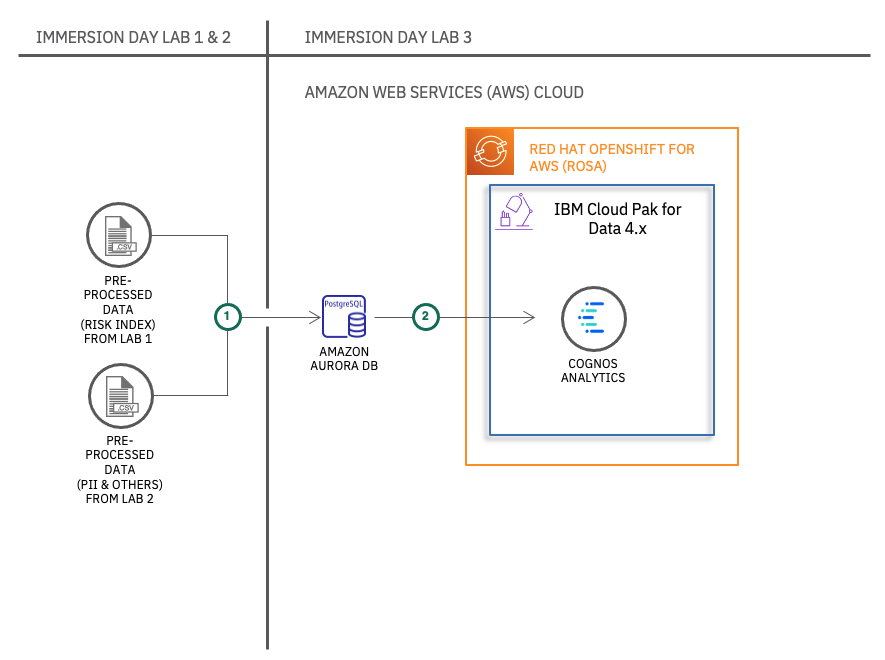

# Short Title

Build IBM Cognos Analytics dashboards on IBM Cloud Pak for Data

# Long Title

Generate visualizations using Cognos Analytics of IBM Cloud Pak for Data on AWS opneshift Cluster

# Author

* [Srikanth Manne](https://developer.ibm.com/profiles/srikanth.manne)
* [Rahul Reddy Ravipally](https://developer.ibm.com/profiles/raravi86)
* [Manoj Jahgirdar](https://developer.ibm.com/profiles/manoj.jahgirdar)

# URLs

### Github repo

* https://github.ibm.com/ibm-aws/ibm-aws-immersion-day-lab-3

# Summary

In this workshop, we will demonstrate the following 3 usecases:

 * Showcase Risk Index widget which will have complete insights of the current covid metrics.
 * Display data using Data Virtualization view as a source in IBM Cogons Analytics dashboard.
 * Showcase the AI capabilities of Cognos Analytics such as Exploration of data and Watson assistant features.

# Description

The intent of this workshop is to educate users about the capabilities of IBM Cognos Analytics and how it can be used with AWS.

When you have completed this Lab, you will understand how to:

 * Build IBM Cognos Analytics dashboards on IBM Cloud Pak for Data.
 * Use AI capabilities of Cognos Analytics.
 * Derive meaningful insights from data using dashboards.

# Flow

# Instructions

> Find the detailed steps in the [README](https://github.ibm.com/ibm-aws/ibm-aws-immersion-day-lab-3/blob/main/README.md) file.

1. Upload Datasets to AWS Aurora Postgres DB
2. Login to your IBM Cloud Pak for Data instance which is hosted on AWS openshift cluster
3. Launch IBM Cognos Analytics instance on IBM Cloud Pak for Data
4. Connect data sources to IBM Cognos Analytics for building dashboards
5. Create the data modules
6. Create and visualize IBM Cognos Analytics dashboard
7. Showcasing the AI capabilities of Cognos Analytics
8. Import and export the IBM Cognos Analytics dashboard binaries in the IBM Cloud Pak for Data environment

# Components and services

* IBM Cognos Analytics
* IBM Cloud Pak for Data Watson Studio
* IBM Cloud Pak for Data Refinery
